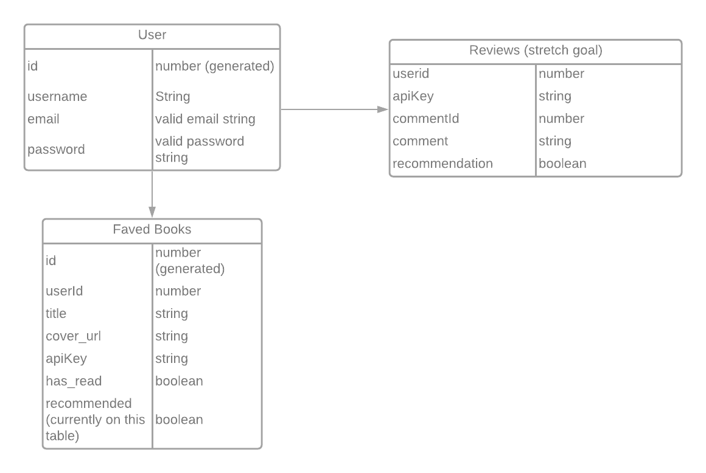

# Booxploration - back end

[**Deployed App**](https://booxploration.herokuapp.com/)

[**Link to Frontend Repo**](https://github.com/lind1125/project_4_frontend)

---

### Technologies used:

  * Python (version 3.8.7)
  * PostgreSQL
  * Peewee
  * Flask
  * flask-login
  * CORS

---

### General Approach

After briefly exploring its capabilities in class, I was interested in building out a back end using Flask/Python to gain a better understanding of both. Using a new language and framework also allowed me to continue to strengthen my comprehension of RESTful routing and CRUD since I had to learn a new way to incorporate them into my app.

I tested all of my routes using Postman before building out my front end, refactoring as needed when circumstances required in the development process (see [Major Hurdles](#major-hurdles))

---

### Installation instructions:

* Fork and clone repo
* Set up and run a virtual environment
* run `pip install requirements.txt ` on the command line
* create database in PSQL and set as `DATABASE` variable in `models.py`
* run `python app.py` in the command line to initiate models

---

### ERD (tentative)

[Lucidchart ERD](https://lucid.app/lucidchart/invitations/accept/40bfce45-05f1-4de1-90f2-a3baeb77a9d1)

### Routes:

| Verb | Endpoint | Action |
| ----------- | ----------- | ----------- |
| GET | '/' | Home page |
| POST | 'api/v1/persons/register' | Register user |
| POST | 'api/v1/persons/login' | Login user |
| GET | 'api/v1/persons/logout' | Logout user |
| GET | 'api/v1/persons/profile' | View user profile |
| ------ | ----------- | ----------- |
| GET | 'api/v1/books/faves' | View faved books |
| POST | 'api/v1/books/addfave' | Add book to faved books |
| PUT | 'api/v1/books/faves/:id | Update faved book |
| DELETE | 'api/v1/books/faves/:id | Delete faved book |

---
### Major Hurdles

Understanding how to work with the model relationships as well as auth and session persistence proved to be quite challenging. I ended up reading (and re-reading) sections of the Flask and flask-login docs, as well as running through the first half or so of [Miguel Grinberg's Flask Mega-Tutorial](https://blog.miguelgrinberg.com/post/the-flask-mega-tutorial-part-i-hello-world) to try to get a better handle on what elements of the program were coming from flask, flask-login, and what were native to Python itself.

Once my local set up was functioning as expected, deployment to Heroku created new issues in getting protected routes to function as intended. Much of my understanding (limited as it still is) came from troubleshooting with my peers in the cohort who were also building a back end using Flask.

---

### Acknowledgements

* Thank you to the GA team giving me the tools to explore this language/framework

* Big thanks to Room 5 for the frequent debugging help and the constant camaraderie

* Thanks to Miguel Grinberg for laying out Flask concepts in an easy-to-digest way.
